国泰海通资产配置（CI011800.WI）
中信期货大类资产配置（CICSF040.WI）
国泰海通全天候（CI011001.WI）
银河全天候（GALLW.WI）

---

# [模块1 研究问题] 样本内外设定

|        | 切分点          | 证明           |
| ------ | ------------ | ------------ |
| 发布前回溯期 | 指数为100时至发布日期 | 发布时对外展示的历史曲线 |
| 发布后运行期 | 发布日至今        | 公开发布后的指数表现   |

- 切分锚点取**最后一个不晚于发布日期的实际有效点位**，并同时作为前段终点和后段起点。
- 共享锚点保证累计收益不断档，但仍需同时保留完整回撤路径，防止跨发布日期的风险事件被切断。
- CICSF040 的基日=发布日期，只说明公开指数序列没有回溯段。

---

# [模块1 研究问题] 可交易历史与回溯历史

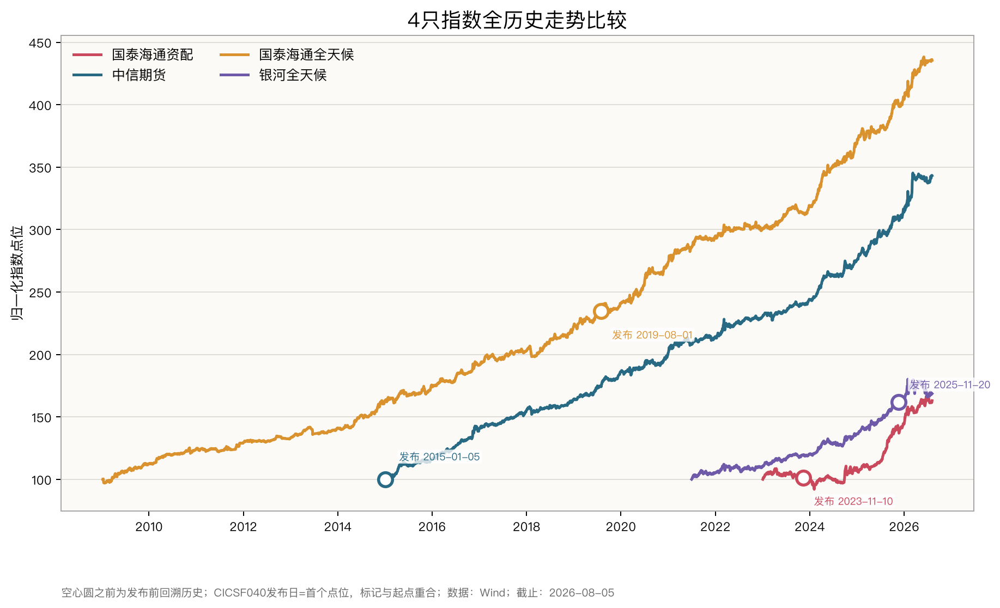

- **构造方式**：每只指数以自身首个实际点位归一为100；空心圆为 Wind 发布日期。CICSF040的发布日等于首个点位，所以圆点与起点重合。
- **读图**：CI011001 约60%的全历史年数、GALLW 约86%的全历史年数发生在正式发布前；CICSF040 全部是发布后记录。
- **含义**：GALLW 的“完美曲线”主要来自发布前回溯，样本外只有0.71年；CICSF040 的长期表现证据更接近真实运行。

> **异常分析**：四条曲线长度差异极大，不能把终点高度直接理解成策略优劣。GALLW约86%的历史位于发布前，而CICSF040没有发布前曲线；二者的“全历史”证据属性完全不同。

---

# [模块2 研究设计] 数据与研究流程

```text
Index_Daily 实际更新日点位 ─→ 清洗/对账 ─→ 发布日切分 ─→ 绩效与稳定性
             │                                  └─→ 年度/滚动/回撤/压力
Index_Info 元数据 ───────────→ 基日、基点、发布日期、收益类型
Constituents_Weights ────────→ 名单变化
```

- 主结果只使用 `Index_Daily` 的真实更新记录，截止日统一为2026-08-05，与公众号原文分析日一致。
- UQER 查名称/行情/成分/权重查询，均为空。

---

# [模块2 研究设计] 指标口径

$$R_{ann}=\left(\frac{P_T}{P_0}\right)^{1/Y}-1$$

$$\sigma_{ann}=Std(r_d)\sqrt{252}$$

$$Sharpe=\frac{\overline{r_d}-r_{f,d}}{Std(r_d)}\sqrt{252}$$

$$MDD=\min_t\left(\frac{P_t}{\max_{s\le t}P_s}-1\right)$$

- $Y$ 用实际日历天数 / 365.2425；主夏普 $R_f=1.5\%$。
- 同时保留零无风险利率、日频与月频夏普，反查原文口径。

---

# [模块2 研究设计] 参数固定

| 环节     | 本项目固定设置               | 为什么这样设           |
| ------ | --------------------- | ---------------- |
| 数据截止   | 2026-08-05            | 与原文分析日一致       |
| 缺失日    | 不前向填充                 | 不制造零收益、不过度平滑波动   |
| 发布切分   | 最后一个≤发布日期的点位，共享锚点     | 保持前后累计收益定义一致     |
| 年化收益   | 实际天数/365.2425的几何CAGR  | 不受不同交易日历影响       |
| 波动/主夏普 | 日频、√252、样本标准差、Rf=1.5% | 统一横向比较           |
| 滚动指标   | 252个实际观测              | 约一个交易年，不是252个日历日 |
| 年度收益   | 前年末至当年末；首年从首点开始       | 避免把1月首个点误作全年基准   |
| 压力窗口   | 5个预设事件窗口              | 只观察结果，不事后搜索最差区间  |
| 成分变化   | 相邻快照Jaccard           | 只衡量名单重合，不冒充真实换手率 |

---

# [模块3 公众号复核] 可复现项与不一致项

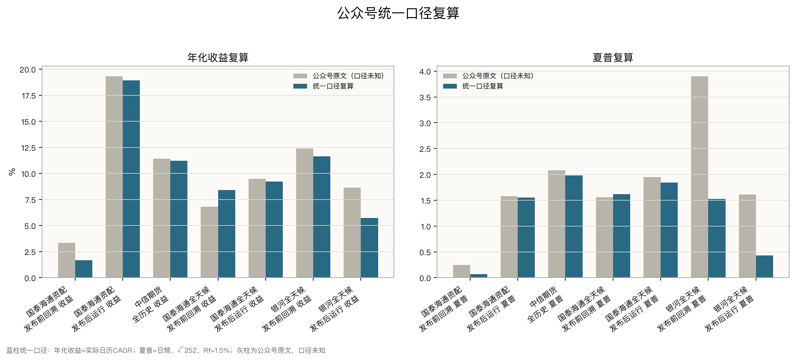

- 灰柱为公众号原文，计算口径未知；蓝柱全部使用本项目主口径：年化收益为实际日历 CAGR，夏普为日频、√252、Rf=1.5%。
- 收益存在版本/算法差：CI011800 发布前年化统一复算为 **1.68%**，不是 3.36%。
- GALLW 差异最大：发布前统一夏普为 **1.52**，不是 3.90；发布后为 **0.43**，不是 1.61。
- 这张图用于检验原文与统一口径结果的差异，不能据此反推公众号原作者使用了什么公式。

# 统一口径后的发布前后结果

| 指数/区间            |    年数 |   年化收益 |   年化波动 |    最大回撤 | 夏普 Rf=1.5% |
| ---------------- | ----: | -----: | -----: | ------: | ---------: |
| CI011800 发布前     |  0.85 |  1.68% |  8.57% |  -9.93% |       0.07 |
| CI011800 发布后     |  2.74 | 18.94% | 11.07% | -10.29% |       1.55 |
| CICSF040 全历史=发布后 | 11.58 | 11.24% |  4.87% |  -3.85% |       1.98 |
| CI011001 发布前     | 10.56 |  8.41% |  4.31% |  -4.26% |       1.62 |
| CI011001 发布后     |  7.01 |  9.22% |  4.23% |  -3.04% |       1.84 |
| GALLW 发布前        |  4.39 | 11.63% |  6.67% |  -5.44% |       1.52 |
| GALLW 发布后        |  0.71 |  5.73% | 11.57% |  -7.99% |       0.43 |

---

# [模块4 绩效比较] 收益与回撤

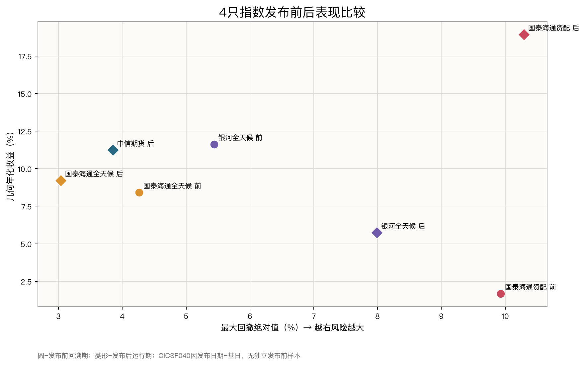

- **CI011800**：年化由1.68%升至18.94%，回撤绝对值也由9.93%升至10.29%。
- **CI011001**：年化提高0.81个百分点，同时回撤缩小1.22个百分点；方向最好，但优势很小。
- **GALLW**：年化下降5.90个百分点，回撤扩大2.55个百分点；收益和风险同时恶化。
- **CICSF040**：没有独立发布前点，11.6年公开运行期本身就是它最重要的证据。

> **异常分析**：CI011800发布后收益跃升最显著，但波动和回撤并未同步下降；GALLW则同时出现收益下降、波动上升和回撤扩大。CI011001的改善幅度很小，不能仅凭点估计宣称策略发布后变得更有效。

---

# [模块4 绩效比较] 共同区间比较

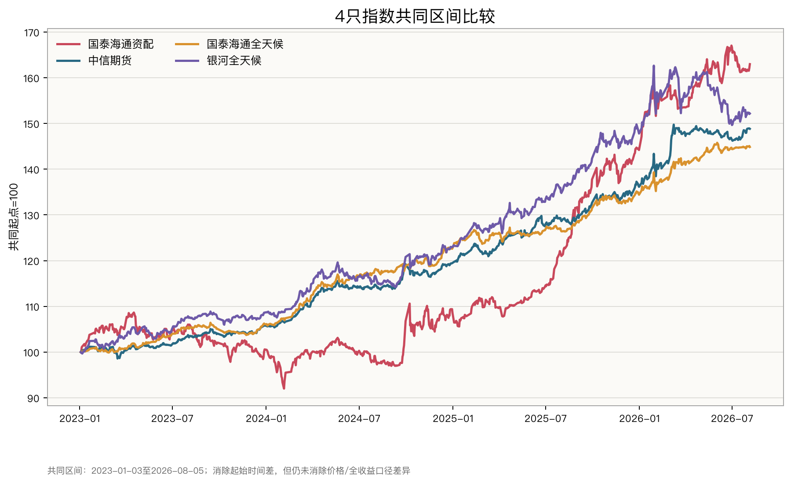

共同区间（2023-01-03—2026-08-05）：

|    指数    |  年化收益  |   波动   |  最大回撤   |
| :------: | :----: | :----: | :-----: |
| CI011800 | 14.59% | 10.54% | -15.32% |
| CICSF040 | 11.73% | 4.87%  | -3.42%  |
| CI011001 | 10.89% | 4.23%  | -2.95%  |
|  GALLW   | 12.42% | 7.60%  | -7.99%  |

- 截至期末，CI011800累计约+63.0%，但它的全历史最大回撤-15.32%也是四只最大；CICSF040和CI011001的累计收益较低，却以约4%波动获得更高风险调整后效率。
- 2025年下半年以前 CI011800 长期落后，随后迅速反超；排名对截点高度敏感，不能只截取终点排序。

> **异常分析**：CI011800在相同区间内收益最高，但最大回撤约为两只低波指数的5倍。异常不在于“收益高”，而在于收益排名与风险效率排名明显分离，单看终点会掩盖路径代价。

---

# [模块5 稳定性] 年度收益

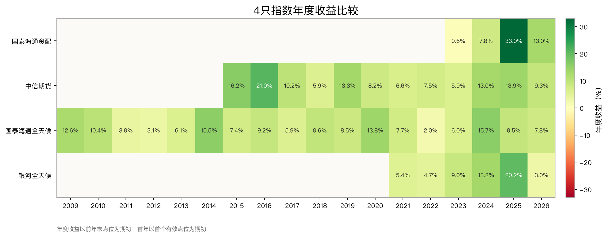

- CI011800：2024 **+7.82%** → 2025 **+32.98%** → 2026 YTD **+13.02%**。
- 2025 不只 CI011800 好：GALLW +20.19%、CICSF040 +13.91%、CI011001 +9.49%。
- 因此 CI011800 的“明星年”既含自身策略/暴露，也含共同市场顺风，不能全部归为选资产能力。
- 稳定性不能只看全期夏普；应看年度分布、滚动夏普和回撤持续时间。

> **异常分析**：CI011800的2025年收益32.98%，明显高于自身其他年份；但2025年四只指数全部上涨，因此其中既可能有指数自身暴露，也有共同市场顺风。缺少历史权重时，不能把超额部分直接归因为择时能力。

---

# [模块5 稳定性] 年度收益集中度

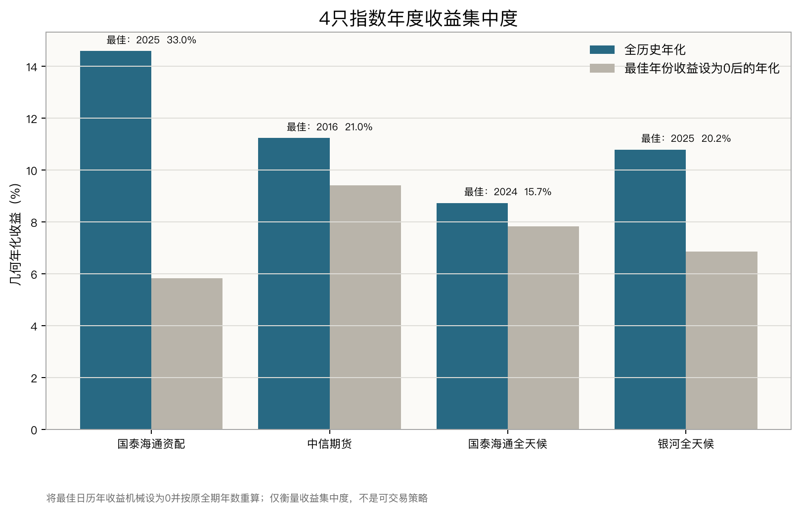

| 指数       |  全历史年化 |        最佳年份 | 最佳年设为0后的年化 |     年化下降 |
| -------- | -----: | ----------: | ---------: | -------: |
| CI011800 | 14.59% | 2025：32.98% |      5.84% | 8.75个百分点 |
| CICSF040 | 11.24% | 2016：20.96% |      9.42% | 1.81个百分点 |
| CI011001 |  8.73% | 2024：15.74% |      7.83% | 0.90个百分点 |
| GALLW    | 10.79% | 2025：20.19% |      6.86% | 3.93个百分点 |

- CI011800 的高全期年化最依赖单一年度；CICSF040 和 CI011001 去掉最佳年后仍保留较高年化，时间分散更强。
- GALLW 也明显依赖2025，但弱于 CI011800。
- 这是把最佳年机械设为0的**描述性反事实**，不是投资者能事先剔除最佳年的交易策略。

> **异常分析**：将最佳年设为0后，CI011800年化下降8.75个百分点，远高于其他三只，说明全历史结果对2025年高度敏感。这只能衡量收益集中度，不能证明该年收益不可持续。

---

# [模块5 稳定性] 滚动夏普

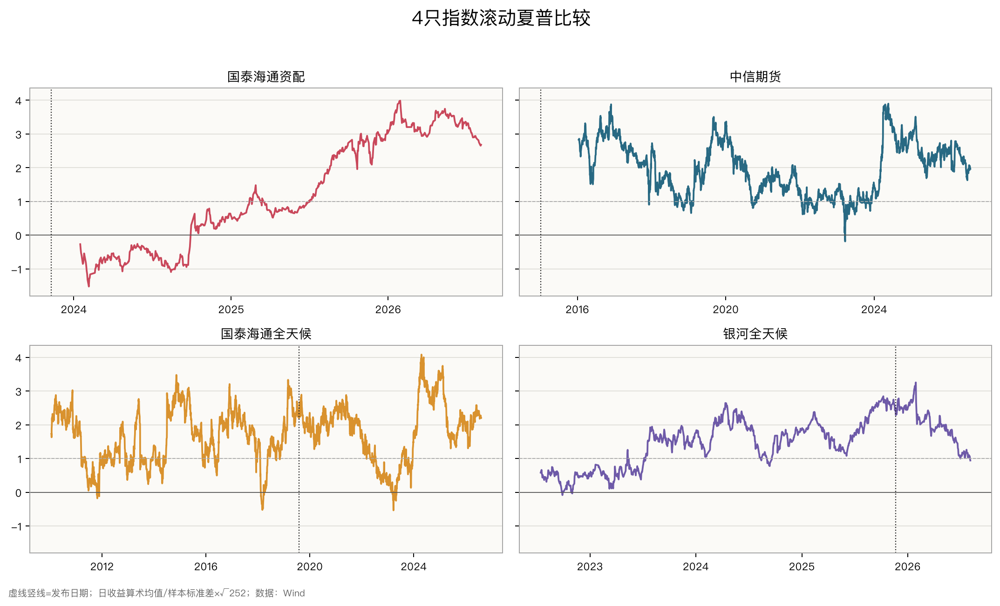

| 指数       |  有效窗口 |    最低 |   最高 |   最新 |  >0占比 |  >1占比 |
| -------- | ----: | ----: | ---: | ---: | ----: | ----: |
| CI011800 |   617 | -1.52 | 3.99 | 2.68 | 72.4% | 46.0% |
| CICSF040 | 2,564 | -0.19 | 3.90 | 1.96 | 99.9% | 89.0% |
| CI011001 | 4,017 | -0.54 | 4.08 | 2.20 | 98.4% | 76.0% |
| GALLW    |   984 | -0.08 | 3.26 | 0.94 | 99.5% | 74.2% |

- CICSF040：2,564个有效窗口中 **99.9%>0、89.0%>1**；最低-0.19，最新1.96，运行稳定性最强。
- CI011001：**98.4%>0、76.0%>1**；最低-0.54，最新2.20，但高低阶段仍明显。
- GALLW：发布后从2026年1月高点3.26持续下行，最新0.94；全历史窗口多数仍来自发布前。
- CI011800：仅 **46.0%窗口>1**，最低-1.52、最高3.99、最新2.68；高全期结果由完全不同的阶段拼成。

> **异常分析**：CI011800滚动夏普从-1.52到3.99，状态切换幅度最大；CICSF040长期接近高位且仅极少窗口低于0，这种平滑性优于常见风险资产组合，值得优先核查指数规则、收益处理和真实产品跟踪结果。

---

# [模块6 归因线索] CI011800成分变化

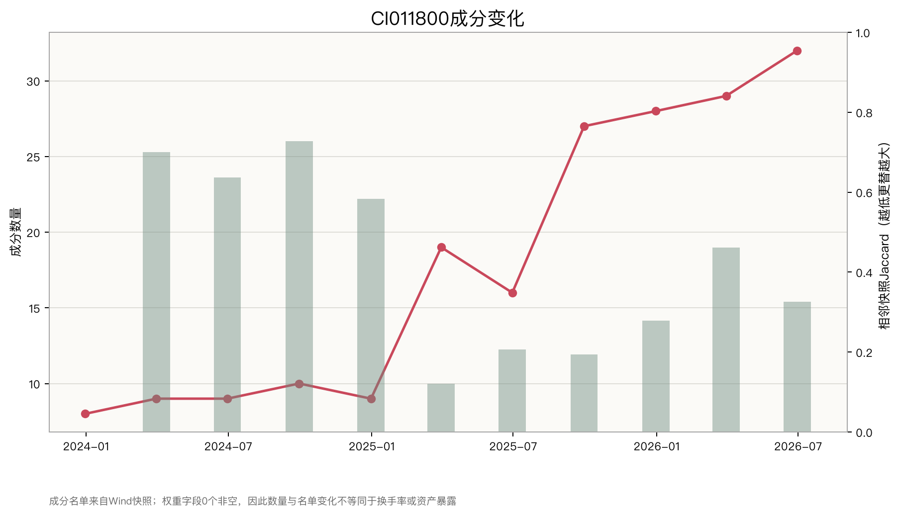

已知：

- 成分数量由 2023Q4 的 8 只增至 2026Q2 的 32 只。
- 2025 年多个季度相邻名单 Jaccard 低于 0.30，名单更替显著。
- 最新名单横跨主题权益、海外权益、债券、商品、黄金与 REITs。

---

# [模块7 市场状态] 事件窗口表现

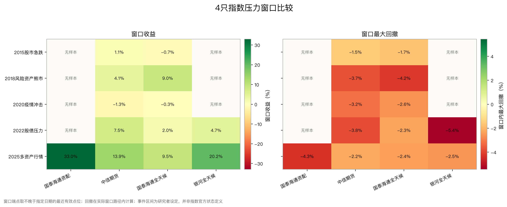

- 2015、2018、2020 只有 CICSF040 与 CI011001 有可比样本。
- 2022 股债压力窗口三只期末均为正，但窗口内仍分别回撤：CICSF040 -3.8%、CI011001 -2.3%、GALLW -5.4%。
- 2025 四只普遍上涨，说明市场环境是解释“样本外明星”的共同变量；其中 CI011800 期末+33.0%，中途仍有-4.3%回撤。
- 没有历史权重时，不能把窗口收益归因为黄金、债券或择时。

---

# [模块8 压力测试] 完整回撤路径

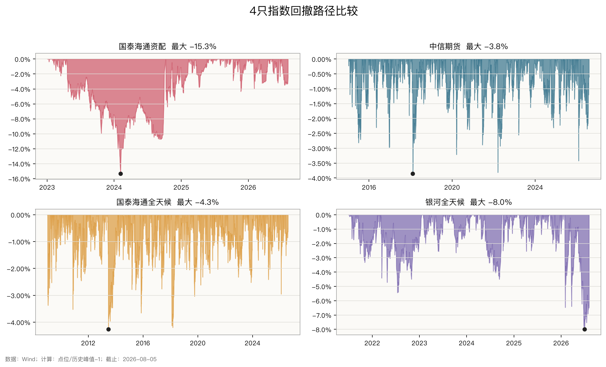

最关键发现：

- CI011800 发布前回撤 -9.93%，发布后回撤 -10.29%，但**全历史最大回撤为 -15.32%**。
- 原因：2023-11-10 发布时指数仍处于从 2023-04-17 高点开始的回撤；分段后换了净值基准。
- GALLW 发布后的最大回撤 -7.99%尚未修复，水下已持续 188 个日历日（截至截止日）。

---

# [模块9 样本与稳健性] 前后差异的统计区间

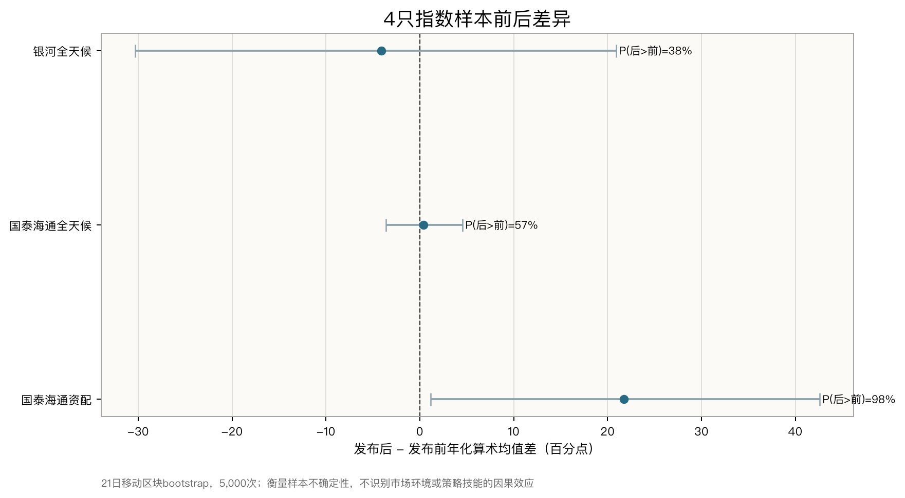

- CI011800：发布后均值改善较明显，但发布前只有 206 个日收益，且可能受行情与成分变化共同驱动。
- CI011001：$P(发布后>发布前)=57\%$，接近掷硬币；“样本外更好”不具强统计证据。
- GALLW：$P(发布后>发布前)=38\%$，衰减方向存在，但 171 个发布后日收益不足以稳定定性。
- 区块 bootstrap 保留短期相关，只衡量样本不确定性；它不是市场环境或策略技能的因果检验。

图上横轴是“发布后减发布前的年化算术日均收益差”：

- CI011800 点估计约+21.76个百分点，95%区间约+1.13至+42.57，方向在本设定下为正；但前段只有206个日收益，且两段市场环境完全不同。
- CI011001 点估计仅+0.40个百分点，95%区间约-3.63至+4.54，不能排除没有变化。
- GALLW 点估计-4.08个百分点，95%区间约-30.32至+20.92；“衰减方向”有经济含义，但统计精度很低。

> **异常分析**：CI011001和GALLW的95%区间均跨0，且GALLW区间极宽，意味着当前样本既容许显著恶化，也容许明显改善。图中的概率和区间只描述抽样不确定性，不是策略技能或市场环境的因果检验。

---

# [模块10 个案分析] CI011800国泰海通资产配置指数

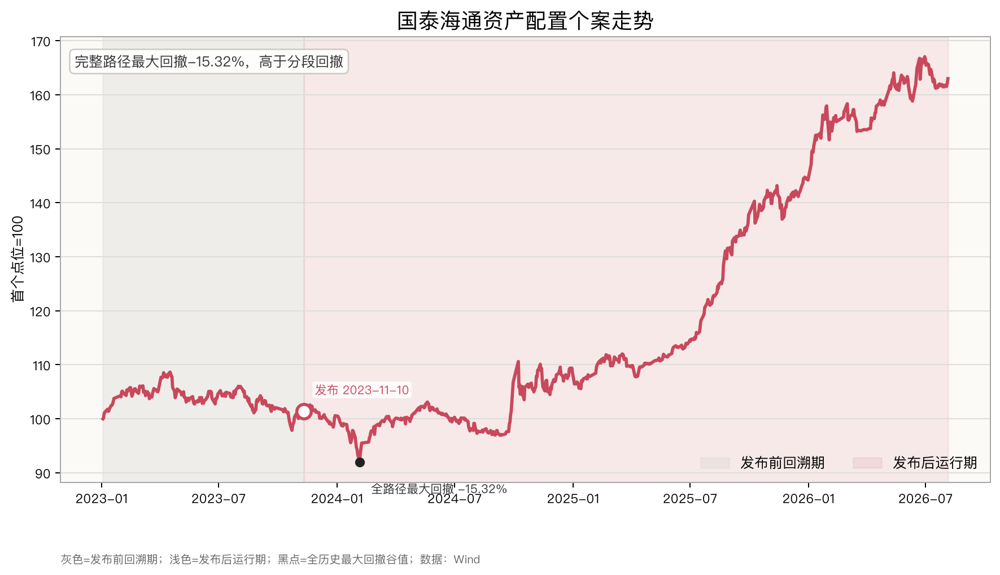

| 当前复算       |    发布前 |     发布后 |
| ---------- | -----: | ------: |
| 年化收益       |  1.68% |  18.94% |
| 年化波动       |  8.57% |  11.07% |
| 最大回撤       | -9.93% | -10.29% |
| 夏普 Rf=1.5% |   0.07 |    1.55 |

- 2026 YTD 实际 +13.02%，按日历时间年化约 +22.88%。
- 2025 +32.98%是突出事实，但完整跨发布日回撤 -15.32%被分段数字遮住。
- 名单更替大、资产跨度广，但没有权重，无法判断是分散配置还是主题集中。

> **个案异常**：完整路径最大回撤-15.32%高于任一分段回撤，且2025年贡献了大部分全历史年化。它提示收益高度集中、发布前后状态差异大，但不能在缺少权重时指认具体风口资产。

---

# [模块10 个案分析] CICSF040中信期货大类资产配置指数

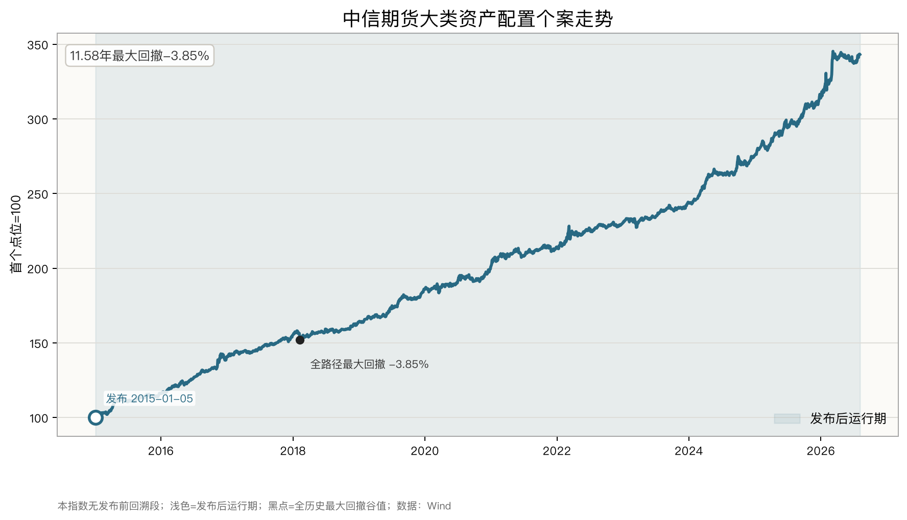

| 全历史=发布后运行期 |   当前复算 |
| ---------- | -----: |
| 年化收益       | 11.24% |
| 年化波动       |  4.87% |
| 最大回撤       | -3.85% |
| 夏普 Rf=1.5% |   1.98 |
| 历史长度       | 11.58年 |

- 基日=发布日期，公开曲线没有发布前回溯段，这是强证据。
- 作为价格指数，与全收益指数比较可能低估其相对收益，但真实产品成本同样未知。

> **个案异常**：11.58年年化11.24%、波动4.87%、最大回撤仅-3.85%，风险收益组合异常平滑。由于它是价格指数且缺少真实产品净值，需通过正式规则、历史权重和跟踪产品验证。

---

# [模块10 个案分析] CI011001国泰海通全天候

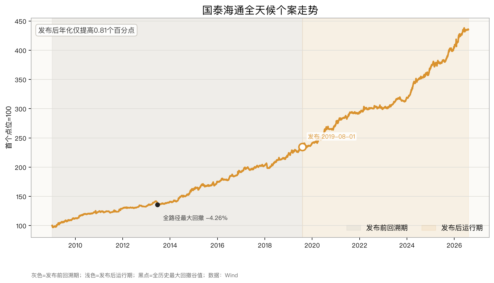

| 当前复算 | 发布前 | 发布后 |
|---|---:|---:|
| 年化收益 | 8.41% | 9.22% |
| 年化波动 | 4.31% | 4.23% |
| 最大回撤 | -4.26% | -3.04% |
| 夏普 Rf=1.5% | 1.62 | 1.84 |

- 资产与机制说明相对完整。
- bootstrap 对“发布后均值更高”的概率仅 57%，优势区间跨 0。

> **个案异常**：发布后年化仅提高0.81个百分点，bootstrap改善概率57%、区间跨0。视觉上的“样本外更好”是真实点估计，但统计上不足以排除没有变化。

---

# [模块10 个案分析] GALLW银河全天候

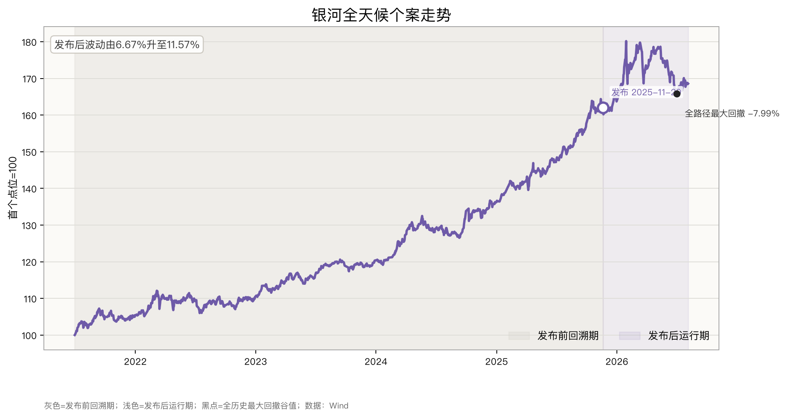

| 当前复算       |    发布前 |    发布后 |
| ---------- | -----: | -----: |
| 年化收益       | 11.63% |  5.73% |
| 年化波动       |  6.67% | 11.57% |
| 最大回撤       | -5.44% | -7.99% |
| 夏普 Rf=1.5% |   1.52 |   0.43 |

- 当前数据无法复现原文“样本内夏普3.90 / 样本外1.61”。
- 发布后只有 0.71 年、171 个日收益，波动与回撤上升，但统计区间很宽。
- 2026 YTD 仅 +2.97%。

> **个案异常**：发布后波动从6.67%升至11.57%，回撤扩大至-7.99%，但样本只有171个日收益；同时原文夏普无法复现。这里应先报告“恶化方向与高不确定性并存”，而不是直接下过拟合结论。

---

# [模块11 结论] 样本内魔术与样本外现实

1. **文章主线成立**：发布前回溯曲线必须与发布后运行记录分开。
2. **原文数字不够可靠**：尤其是 GALLW 夏普与 CI011001 发布前年化。
3. **核心问题**：
   - CI011800：高收益；
   - CICSF040：长期最稳；
   - CI011001：样本外略优，但统计优势不强；
   - GALLW：出现衰减，但样本太短、原文夏普不可复现。
