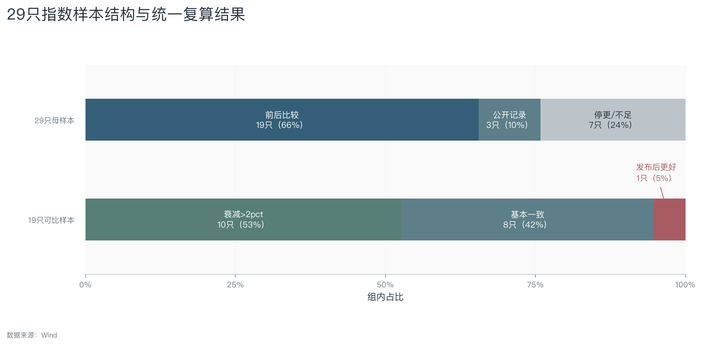
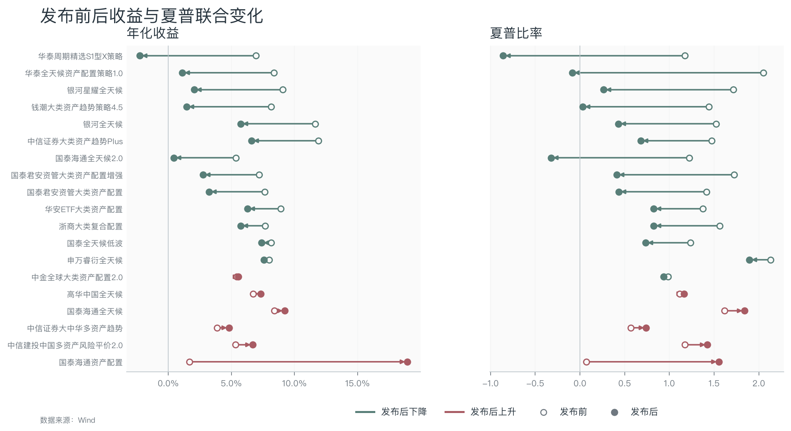
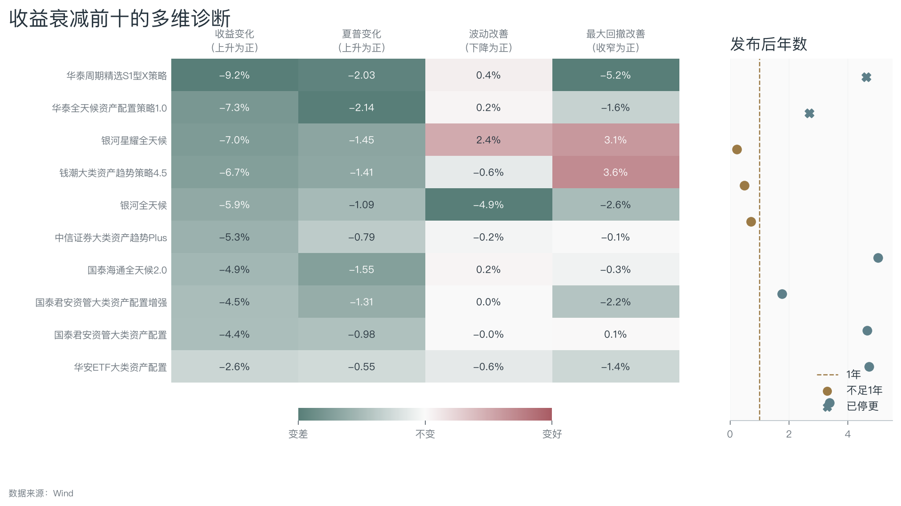
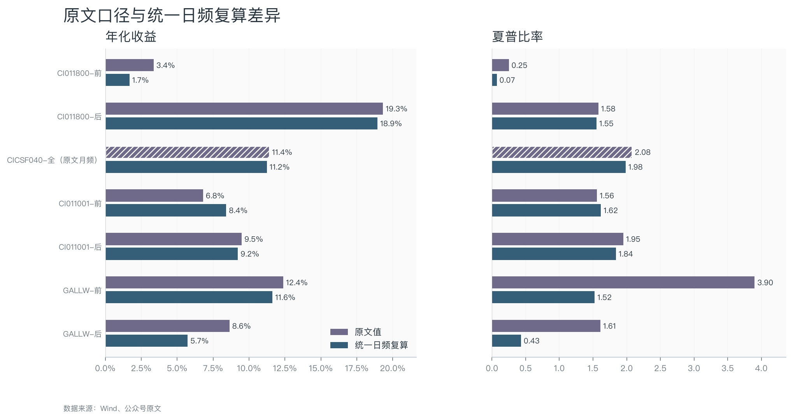
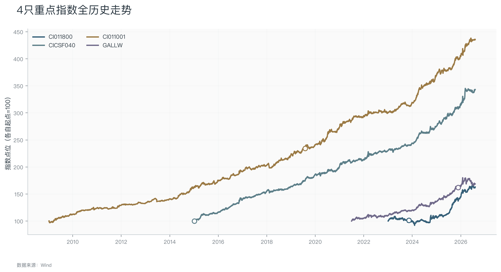
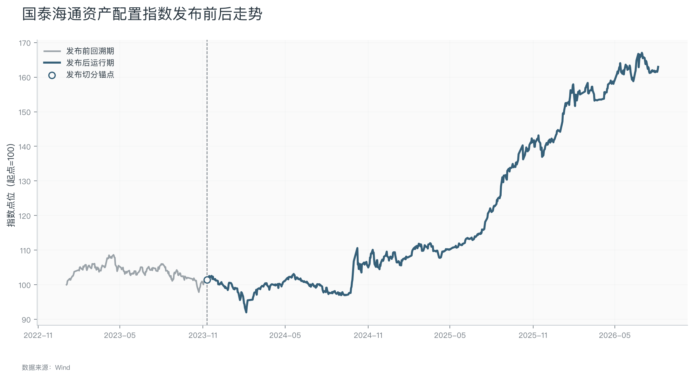
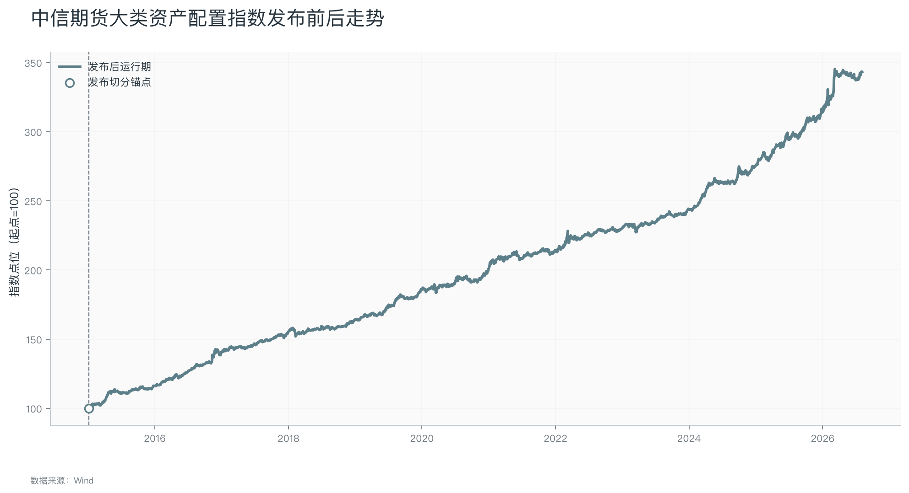
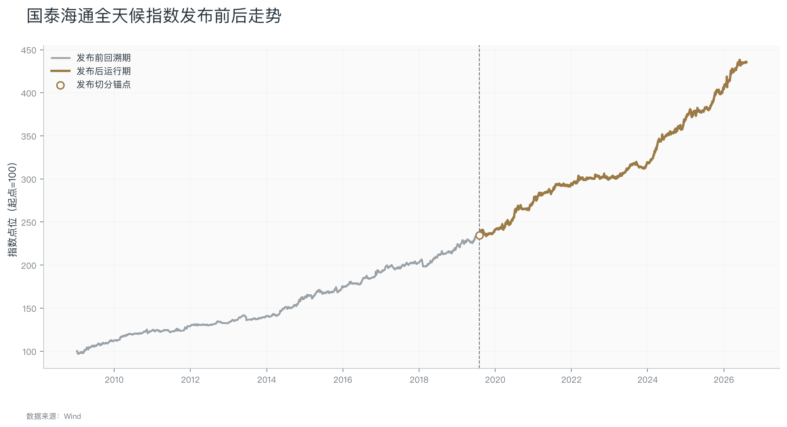
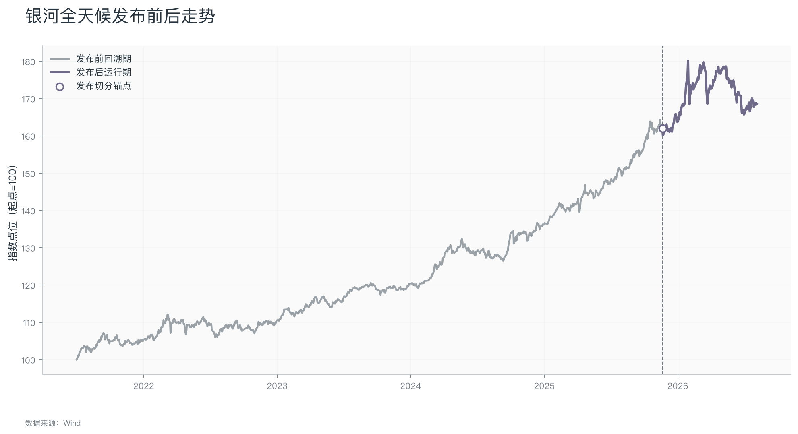
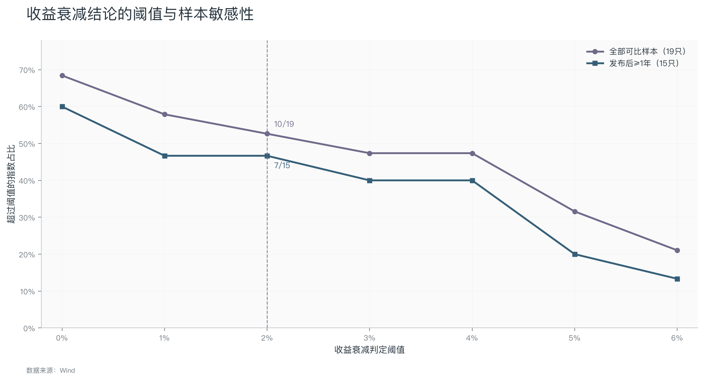

<!-- _class: lead -->
# 券商多资产配置指数深度研究

## 29只指数全景比较与4只重点指数分析

**研究目标：** 基于Wind数据检验发布前回溯表现、发布后运行表现及其差异

数据截止：2026-08-05 
统一口径可复算 19 只，其中 10 只收益衰减超过2个百分点

---
# 汇报结构

1. **样本与方法：** 指数筛选、排除标准和发布前后切分口径。
2. **全景比较：** 29只指数的数据状态、收益变化和风险调整后表现。
3. **重点个案：** 4只指数的资产选择、发行材料、走势与证据边界。
4. **机制分析：** 多资产策略的过拟合来源与替代解释。
5. **研究评价：** 原文发现的可复现性、结论边界与待补证据。

---
# [背景1] 指数筛选与方法论

**公众号原文的筛选逻辑**

1. 在Wind指数库检索包含“全天候”“资产配置”“大类资产配置”“多资产”“风险平价”等关键词的券商发行指数；
2. 逐只核查底层资产，要求至少覆盖股票、债券、商品、另类中的两个大类；
3. 排除纯权益、纯固收、纯另类或行业主题指数，以及非策略型基金基准指数；

按基日与发布日期切分“样本内”和“样本外”，最终得到29只指数：19只可比较发布前后，3只仅有公开运行记录，7只停更或数据不足。

> [!info] 样本内 / 样本外定义
> **样本内**：基日 → 发布日前一天。这是指数编制者可以反复调试、优化参数的“实验室”阶段。
>
> **样本外**：发布日期 → 2026年8月5日。这是指数发布后面对真实市场的“考场”阶段。
>
> ⚠️ **核心逻辑**：如果一只指数在样本内表现优异但样本外大幅衰减，说明可能存在严重的**过拟合**——策略被过度调参以拟合历史数据，缺乏真正的预测能力。

**本研究中的标的**

- 不重新构造样本池，直接以公众号原文筛出的29只指数作为研究母样本；
- 使用Wind补充基本信息和实际更新日行情，并按统一公式复算收益、波动、回撤和夏普；
- 先比较29只指数的整体分布，再对4只重点指数分析资产选择、运行表现和证据边界。

---
<!-- _class: universe -->
# [背景2] 29只券商多资产配置指数研究样本

| 发布前后比较①                                       | 发布前后比较②                                          | 样本内数据缺失（3只）                                        | 停更/数据不足（7只）                                     |
| --------------------------------------------- | ------------------------------------------------ | -------------------------------------------------- | ----------------------------------------------- |
| 1. 国泰海通全天候 <small>CI011001.WI</small>      | 12. 中信建投中国多资产风险平价2.0 <small>CARP2.WI</small>  | 5. 中信期货大类资产配置 <small>CICSF040.WI</small>        | 23. 中信建投全球多资产风险平价 <small>GARP.WI</small>     |
| 2. 国泰海通全天候2.0 <small>GMARS.WI</small>      | 13. 国泰全天候低波 <small>GT01.WI</small>            | 21. 申万睿衍全球多资产智能配置2.0 <small>SWSMART2.WI</small> | 24. 申万宏源全球多资产智能配置 <small>CI017003.WI</small> |
| 3. 国泰海通资产配置 <small>CI011800.WI</small>     | 14. 浙商大类复合配置 <small>CI066001.WI</small>       | 22. 东证全球大类策略 <small>VENUS.WI</small>            | 25. 中国大类资产动量配置 <small>CMAM.WI</small>        |
| 4. 中金全球大类资产配置2.0 <small>CMARS2.WI</small>  | 15. 国泰君安资管大类资产配置 <small>GCA.WI</small>        |                                                    | 26. 高华中国全天候增强 <small>CALLWE.WI</small>       |
| 6. 银河全天候 <small>GALLW.WI</small>           | 16. 国泰君安资管大类资产配置增强 <small>GCAPLUS.WI</small>  |                                                    | 27. 国联民生多资产 <small>GLMS888806.WI</small>     |
| 7. 银河星耀全天候 <small>GSAW.WI</small>          | 17. 中信证券大类资产趋势Plus <small>GMATPLUS.WI</small> |                                                    | 28. 申万全球多资产定制策略1.0 <small>SMILE1.WI</small>  |
| 8. 高华中国全天候 <small>CALLW.WI</small>         | 18. 中信证券大中华多资产趋势 <small>CMAT.WI</small>       |                                                    | 29. 中信证券大类资产趋势Max <small>GMATMAX.WI</small>  |
| 9. 申万睿衍全天候 <small>SWALLW.WI</small>        | 19. 钱潮大类资产趋势策略4.5 <small>QMATS.WI</small>     |                                                    |                                                 |
| 10. 华安ETF大类资产配置 <small>801639.SI</small>   | 20. 华泰周期精选S1型X策略 <small>HYCLES1X.WI</small>   |                                                    |                                                 |
| 11. 华泰全天候资产配置策略1.0 <small>HAWS1.WI</small> |                                                  |                                                    |                                                 |

---
# [背景3] 29只样本结构与统一复算结果

- **样本结构：** 29只中，19只进入发布前后比较，3只只有公开运行记录，7只属于停更或数据不足。
- 19只中10只收益衰减超过2个百分点，8只基本一致，1只发布后更好（国泰海通资产配置指数）。

> 收益衰减并非个别现象，与原文判断方向一致；但这一分布只能提出过拟合担忧，不能直接完成因果归因。

---
# [全景1] 发布后收益与夏普的联合变化

- 空心点为发布前、实心点为发布后，红色箭头表示数值上升，绿色表示数值下降。
- **核心分布：** 19只中13只（68%）收益和夏普同时下降，5只（26%）同时改善，1只（5%）方向不一致；收益衰减超过2个百分点的10只指数中，夏普10/10同步下降。
- **高夏普检验：** 发布前夏普与后续收益衰减的Pearson相关为0.69，但Spearman秩相关仅0.46，剔除CI011800（国泰海通资产配置）后Pearson相关降至0.35。

>发布后弱化不只表现为收益降低，也伴随风险调整后表现走弱；但夏普以收益为分子，两者不是独立证据。“越完美越翻车”可作风险提示，不能写成无例外的统计规律。

---
# [全景2] 收益衰减前十的多维诊断

- **构造方式：** 收益和夏普按“发布后−发布前”计算；波动改善按“发布前波动−发布后波动”计算；最大回撤改善按“发布前回撤幅度−发布后回撤幅度”计算。
- **颜色规则：** 四列全部统一为正值表示改善、负值表示变差；红色=变好，绿色=变差。
- **衰减幅度：** 前十只的年化收益平均下降5.8个百分点，中位数为5.6个百分点，四分位区间为4.6—7.0个百分点；其中6只衰减超过5个百分点。
- **风险共振：** 前十只的夏普全部下降，平均下降1.33、中位数下降1.36；7只最大回撤扩大，5只波动率上升，3只同时出现波动上升和回撤扩大。
- **样本强弱：** 前十只中7只已有一年以上发布后记录；银河星耀全天候、钱潮大类资产趋势策略4.5和银河全天候不足一年，排名仍可能被短期行情和年化处理放大。

> **统计结论：** 前十样本呈现集中且多维的发布后恶化，并非只由一两只极端指数驱动；但前十本就按收益衰减筛选，真正增加信息的是夏普、回撤、波动和样本长度是否同步恶化，仍不能仅凭排名确认过拟合因果。

---
# [计算口径对比] 原文口径与统一日频复算

- **原文口径：** 原文注明日频夏普按√252、月频按√12年化；四只重点指数中CICSF040使用月频，其他三只未标为月频。
- **统一复算：** 为与原文同期对照，本研究统一截止到2026-08-05，全部使用Wind实际更新日、252年化和年化无风险利率1.5%；原文值不进入统一横向排名。
- **读图：** 收益差异相对有限，夏普差异更明显，尤其是GALLW发布前3.90与统一复算1.52。
- **无法确认：** 文章没有说明为什么CICSF040改用月频；可能与数据可得性有关，但现有材料不足以验证。

> **口径纠正：** 月频和日频的年化因子本身都常见，但混频估计受自相关和平滑影响，不能直接横比；已经年化的月频夏普也不应再二次“换算成日频夏普”。

---
<!-- _class: focus -->
# [重点总览] 四只重点指数的证据结构

| 指数                        | 收益类型  | 前/后年数    | 前/后收益      | 前/后夏普     | 复算理解  |
| ------------------------- | ----- | -------- | ---------- | --------- | ----- |
| 国泰海通资产配置 CI011800.WI   | 全收益指数 | 0.9/2.7  | 1.7%/18.9% | 0.07/1.55 | 样本外更好 |
| 中信期货大类资产配置 CICSF040.WI | 价格指数  | —/11.6   | —/11.2%    | —/1.98    | 暂不判断  |
| 国泰海通全天候 CI011001.WI    | 全收益指数 | 10.6/7.0 | 8.4%/9.2%  | 1.62/1.84 | 基本一致  |
| 银河全天候 GALLW.WI         | 价格指数  | 4.4/0.7  | 11.6%/5.7% | 1.52/0.43 | 过拟合   |

> **读图：** 各指数以自身起点归一为100，空心点为发布切分锚点；曲线终点高度同时受历史长度影响，不能直接视为策略优劣。

---
<!-- _class: case -->
# [个案1] 国泰海通资产配置指数（CI011800）

| 区间 | 年数 | 年化收益 | 年化波动 | 最大回撤 | 夏普 |
| --- | --- | --- | --- | --- | --- |
| 发布前回溯期 | 0.9年 | 1.7% | 8.6% | -9.9% | 0.07 |
| 发布后运行期 | 2.7年 | 18.9% | 11.1% | -10.3% | 1.55 |

- **资产选择：** 股票/债券/商品/黄金/REITs/海外；Wind有96个历史成分代码，可用权重0条。
- 【**发行与方法材料：** 后续解构材料(发布后2.3年)、后续研究报告(发布后2.5年)；不将后续材料倒推为发行时规则；未找到发行同期官方方法书；当前资产范围主要依据Wind历史成分记录。】
- **产品与驱动线索：** 收益凭证/场外期权：国泰海通挂钩资产配置指数结构化产品；2025年底层工具中涨幅居前的是嘉实国证通信ETF(85%)、富国中证电池主题ETF(70%)、广发中证香港创新药ETF(65%)；因缺权重，这只是驱动线索，不是贡献归因。
- **原文评价：** 原文将其视为29只中发布后表现最好的“明星”，同时提醒发布前仅约0.86年，2025年高收益可能集中于特定资产或市场环境，可持续性仍需检验。

> **本研究评价：发布后改善明确，但收益来源和可持续性尚未识别。** 统一复算下收益由1.7%升至18.9%、夏普由0.07升至1.55，而最大回撤基本未收窄。这构成对“发布后普遍失效”的强反例；但发布前仅0.85年且无历史权重，不能把高收益归因于某一资产或确认可以延续。 证据边界：缺产品净值、费用、交易成本与跟踪误差，指数收益不等于客户净收益。

---
<!-- _class: case -->
# [个案2] 中信期货大类资产配置指数（CICSF040）

| 区间 | 年数 | 年化收益 | 年化波动 | 最大回撤 | 夏普 |
| --- | --- | --- | --- | --- | --- |
| 公开运行记录 | 11.6年 | 11.2% | 4.9% | -3.8% | 1.98 |

- **资产选择：** 股票/债券/商品；Wind未返回历史成分与权重。
- **发行与方法材料：** 正式方法书/编制方案(发布后10.8年)；不将后续材料倒推为发行时规则；[中信期货官方披露](https://www.citicsf.com/e-futures/about/disclosure?id=734599)确认宏观因子配置叠加风险平价框架，但不足以证明2015年发行时规则完全相同。
- **产品与驱动线索：** 暂无：暂无公开跟踪产品；2025年底层工具中涨幅居前的是SHFE黄金(58%)、SHFE铜(33%)、恒生指数(28%)；因缺权重，这只是驱动线索，不是贡献归因。
- **原文评价：** 原文将其视为长期运行的稳健样本，强调基日等于发布日期、长期收益较高且回撤较低；但其关于月频年化夏普再“换算为日频”的说法需要修正。

> **本研究评价：长期风险收益记录突出，但不是样本内外识别。** 11.6年公开记录的年化收益11.2%、最大回撤3.8%、统一日频夏普1.98均较强。但基日等于发布日期只能证明公开序列没有发布前回溯段，不能证明研发阶段未查看历史数据或未调参。 证据边界：缺产品净值、费用、交易成本与跟踪误差，指数收益不等于客户净收益。

---
<!-- _class: case -->
# [个案3] 国泰海通全天候指数（CI011001）

| 区间 | 年数 | 年化收益 | 年化波动 | 最大回撤 | 夏普 |
| --- | --- | --- | --- | --- | --- |
| 发布前回溯期 | 10.6年 | 8.4% | 4.3% | -4.3% | 1.62 |
| 发布后运行期 | 7.0年 | 9.2% | 4.2% | -3.0% | 1.84 |

- **资产选择：** 股票/债券/商品/黄金；Wind未返回历史成分与权重。
- **发行与方法材料：** 后续研究报告(发布后5.7年)、后续研究报告(发布后5.9年)；不将后续材料倒推为发行时规则；当前可得材料主要为发布后的配置框架研究，不能倒推为2019年发行时完整规则。
- **产品与驱动线索：** 资管计划：国泰海通全天候指数跟踪资管计划；无可用底层行情，不做收益来源推断。
- **原文评价：** 原文将其视为少数发布后表现更好的指数，并将部分优势解释为2019—2021年市场环境贡献，认为策略逻辑可能有效但也享受了环境红利。

> **本研究评价：七年发布后记录稳定，是四只中证据最完整的反例。** 发布后收益由8.4%升至9.2%、夏普由1.62升至1.84、最大回撤由4.3%收窄至3.0%。改善幅度不算巨大，但持续时间足够长；原文提出的市场环境解释合理，却仍缺权重和状态归因支持。 证据边界：缺产品净值、费用、交易成本与跟踪误差，指数收益不等于客户净收益。

---
<!-- _class: case -->
# [个案4] 银河全天候（GALLW）

| 区间 | 年数 | 年化收益 | 年化波动 | 最大回撤 | 夏普 |
| --- | --- | --- | --- | --- | --- |
| 发布前回溯期 | 4.4年 | 11.6% | 6.7% | -5.4% | 1.52 |
| 发布后运行期 | 0.7年 | 5.7% | 11.6% | -8.0% | 0.43 |

- **资产选择：** 待核验；Wind未返回历史成分与权重。
- **发行与方法材料：** 未找到公开方法书或发行同期研报；[银河证券2025年报](https://cdn.chinastock.com.cn/omc/investRelation/sh/601881_20260331_XWZA.pdf)只确认落地全天候大类资产配置指数，未披露资产池和权重机制。
- **产品与驱动线索：** 暂无：暂无公开跟踪产品；无可用底层行情，不做收益来源推断。
- **原文评价：** 原文把发布前夏普3.90视为“完美曲线”，指出发布后夏普回落但仍为正，同时强调发布后仅约0.7年，需要继续观察。

> **本研究评价：收益、夏普、波动和回撤同时恶化，但样本仍太短。** 统一复算下收益由11.6%降至5.7%、夏普由1.52降至0.43、波动由6.7%升至11.6%，回撤也扩大。多维恶化比单看收益更值得警惕，但发布后仅0.71年，尚不足以确认策略长期失效或过拟合因果。 证据边界：缺产品净值、费用、交易成本与跟踪误差，指数收益不等于客户净收益。

---
# [原因] 多资产策略的过拟合机制

| 机制     | 多资产策略中的表现                    | 应补充的检验              |
| ------ | ---------------------------- | ------------------- |
| 设计自由度高 | 资产池、风险预算、回看窗口、调仓频率、权重上下限均可调整 | 披露参数搜索范围、候选版本和冻结日期  |
| 历史选择偏差 | 只展示表现最好的版本，回溯曲线可能经历反复筛选      | 使用真正留出期、滚动走样和多重检验修正 |
| 市场环境变化 | 股债相关性、通胀、波动结构改变，旧参数未必适用      | 做市场状态分层和压力窗口分析      |
| 真实投资摩擦 | 费用、滑点、跟踪误差、QDII额度可能吞噬指数收益    | 用产品净值验证可复制性         |

- **原文判断的合理之处：** 越平滑、夏普越高、回撤越低的回测，越应该接受严格追问。
- **需要修正的：** “发布后变差”还可能来自市场环境、短样本、规则变化和数据版本。

> **结论边界：** 当前证据只能说“与过拟合担忧一致”，不能说“已经证明过拟合”。

---
# [稳健性检验] 收益衰减结论的阈值与样本敏感性

- **2个百分点阈值：** 全部可比样本为10/19；剔除发布后不足1年的指数后为7/15（47%）。
- **更严格阈值：** 当阈值提高到5个百分点时，分别只剩6/19和3/15。
- **分布位置：** 19只指数的收益衰减中位数为2.6%，说明整体方向仍偏向衰减，但“超过一半”的比例依赖阈值与短样本处理。

> **替换理由：** 原图Pearson r=0.69，不能称为“没有相关性”；但剔除CI011800后r降至0.35，Spearman仅0.46，且两变量共享收益成分。因此改用阈值与样本敏感性，直接检验原文“10/19”的稳健程度。

---
# [结论] 收益衰减现象获得支持，过拟合归因仍需审慎

| 可以保留 | 需要修正 | 仍待确认 |
| --- | --- | --- |
| 29只筛选框架与全景比较有价值 | 发布前回溯期不等于严格训练集 | 四只指数的完整方法书与规则版本 |
| 10/19只出现>2个百分点收益衰减 | 发布后变差不等于确认过拟合 | 历史成分、权重和资产收益贡献 |
| 高夏普和低回撤应触发更严格审查 | 短样本与不同收益类型需单独处理 | 产品净值、费用和实际跟踪误差 |
| 四只个案呈现出不同证据属性 | 指数收益不能表述为客户净收益 | 规则修订和历史回溯修订记录 |

**最终表述：** 同口径复算支持“收益衰减并非个别现象”；该现象与过拟合担忧一致，但现有证据不足以把全部衰减统一归因于过拟合。

> 下一步最有价值的补数不是继续增加收益图，而是取得方法书、历史权重和真实产品净值。

---
<!-- _class: appendix -->
# [附录] 29只指数统一指标表（1/3）

| # | 指数 | 前/后收益 | 前/后波动 | 前/后回撤 | 前/后夏普 | 收益差 | 原文/复算 | 项目评价 |
| --- | --- | --- | --- | --- | --- | --- | --- | --- |
| 1 | 国泰海通全天候 CI011001.WI | 8.4%/9.2% | 4.3%/4.2% | -4.3%/-3.0% | 1.62/1.84 | -0.8% | 样本外更好/基本一致 | 前后收益基本一致。 |
| 2 | 国泰海通全天候2.0 GMARS.WI | 5.4%/0.4% | 3.3%/3.1% | -4.0%/-4.3% | 1.22/-0.32 | 4.9% | 严重过拟合/过拟合 | 收益衰减与过拟合担忧一致，非因果证明。 |
| 3 | 国泰海通资产配置 CI011800.WI | 1.7%/18.9% | 8.6%/11.1% | -9.9%/-10.3% | 0.07/1.55 | -17.3% | 样本外更好/样本外更好 | 发布后更好，不支持“发布即失效”。 |
| 4 | 中金全球大类资产配置2.0 CMARS2.WI | 5.4%/5.5% | 4.1%/4.5% | -8.6%/-4.2% | 0.98/0.94 | -0.1% | 基本一致/基本一致 | 前后收益基本一致。 |
| 5 | 中信期货大类资产配置 CICSF040.WI | —/11.2% | —/4.9% | —/-3.8% | —/1.98 | — | 暂不判断/暂不判断 | 无可比回溯段，仅报告运行记录。 |
| 6 | 银河全天候 GALLW.WI | 11.6%/5.7% | 6.7%/11.6% | -5.4%/-8.0% | 1.52/0.43 | 5.9% | 过拟合/过拟合 | 收益衰减与过拟合担忧一致，非因果证明。 后段不足1年。 |
| 7 | 银河星耀全天候 GSAW.WI | 9.1%/2.0% | 4.5%/2.0% | -4.2%/-1.1% | 1.72/0.27 | 7.0% | 严重过拟合/过拟合 | 收益衰减与过拟合担忧一致，非因果证明。 后段不足1年。 |
| 8 | 高华中国全天候 CALLW.WI | 6.7%/7.3% | 4.8%/5.1% | -10.1%/-3.4% | 1.11/1.16 | -0.6% | 基本一致/基本一致 | 前后收益基本一致。 |
| 9 | 申万睿衍全天候 SWALLW.WI | 8.0%/7.6% | 3.1%/3.3% | -4.5%/-2.7% | 2.13/1.90 | 0.4% | 基本一致/基本一致 | 前后收益基本一致。 已停更。 |
| 10 | 华安ETF大类资产配置 801639.SI | 8.9%/6.3% | 5.5%/6.1% | -6.0%/-7.5% | 1.37/0.82 | 2.6% | 过拟合/过拟合 | 收益衰减与过拟合担忧一致，非因果证明。 |

> 前/后=发布前回溯期/发布后运行期；—=无可复算区间；收益差=前收益−后收益。特殊组的补充复算不进入原文19只统计。

---
<!-- _class: appendix -->
# [附录] 29只指数统一指标表（2/3）

| # | 指数 | 前/后收益 | 前/后波动 | 前/后回撤 | 前/后夏普 | 收益差 | 原文/复算 | 项目评价 |
| --- | --- | --- | --- | --- | --- | --- | --- | --- |
| 11 | 华泰全天候资产配置策略1… HAWS1.WI | 8.4%/1.1% | 3.4%/3.2% | -3.2%/-4.8% | 2.05/-0.09 | 7.3% | 严重过拟合/过拟合 | 收益衰减与过拟合担忧一致，非因果证明。 已停更。 |
| 12 | 中信建投中国多资产风险平… CARP2.WI | 5.3%/6.7% | 3.4%/3.8% | -4.5%/-3.8% | 1.17/1.43 | -1.4% | 基本一致/基本一致 | 前后收益基本一致。 |
| 13 | 国泰全天候低波 GT01.WI | 8.2%/7.4% | 5.5%/8.5% | -6.5%/-5.8% | 1.24/0.73 | 0.8% | 基本一致/基本一致 | 前后收益基本一致。 |
| 14 | 浙商大类复合配置 CI066001.WI | 7.7%/5.7% | 4.0%/5.4% | -3.9%/-3.5% | 1.57/0.82 | 2.0% | 基本一致/基本一致 | 前后收益基本一致。 后段不足1年。 |
| 15 | 国泰君安资管大类资产配置 GCA.WI | 7.6%/3.2% | 4.4%/4.4% | -6.1%/-6.0% | 1.42/0.43 | 4.4% | 过拟合/过拟合 | 收益衰减与过拟合担忧一致，非因果证明。 |
| 16 | 国泰君安资管大类资产配置… GCAPLUS.WI | 7.2%/2.7% | 3.4%/3.4% | -3.6%/-5.7% | 1.72/0.41 | 4.5% | 过拟合/过拟合 | 收益衰减与过拟合担忧一致，非因果证明。 |
| 17 | 中信证券大类资产趋势Pl… GMATPLUS.WI | 11.9%/6.6% | 7.1%/7.3% | -10.6%/-10.7% | 1.47/0.68 | 5.3% | 过拟合/过拟合 | 收益衰减与过拟合担忧一致，非因果证明。 |
| 18 | 中信证券大中华多资产趋势 CMAT.WI | 3.9%/4.8% | 4.5%/4.2% | -6.8%/-5.8% | 0.57/0.74 | -1.0% | 基本一致/基本一致 | 前后收益基本一致。 |
| 19 | 钱潮大类资产趋势策略4.5 QMATS.WI | 8.1%/1.5% | 4.7%/5.3% | -6.1%/-2.6% | 1.44/0.03 | 6.7% | 严重过拟合/过拟合 | 收益衰减与过拟合担忧一致，非因果证明。 后段不足1年。 |
| 20 | 华泰周期精选S1型X策略 HYCLES1X.WI | 6.9%/-2.3% | 4.8%/4.4% | -5.3%/-10.4% | 1.17/-0.86 | 9.2% | 严重过拟合/过拟合 | 收益衰减与过拟合担忧一致，非因果证明。 已停更。 |

> 前/后=发布前回溯期/发布后运行期；—=无可复算区间；收益差=前收益−后收益。特殊组的补充复算不进入原文19只统计。

---
<!-- _class: appendix -->
# [附录] 29只指数统一指标表（3/3）

| # | 指数 | 前/后收益 | 前/后波动 | 前/后回撤 | 前/后夏普 | 收益差 | 原文/复算 | 项目评价 |
| --- | --- | --- | --- | --- | --- | --- | --- | --- |
| 21 | 申万睿衍全球多资产智能配… SWSMART2.WI | 3.9%/2.9% | 3.0%/2.8% | -4.4%/-2.9% | 0.87/0.53 | 1.1% | 暂不判断/基本一致 | 前后收益基本一致。 |
| 22 | 东证全球大类策略 VENUS.WI | 9.8%/8.0% | 5.3%/6.7% | -7.0%/-3.7% | 1.58/1.00 | 1.7% | 暂不判断/基本一致 | 前后收益基本一致。 |
| 23 | 中信建投全球多资产风险平价 GARP.WI | 6.1%/1.5% | 4.4%/4.0% | -6.0%/-10.9% | 1.07/0.04 | 4.6% | 停更/数据不足/过拟合 | 原文特殊组；补充复算不进入19只。 |
| 24 | 申万宏源全球多资产智能配置 CI017003.WI | 8.6%/10.5% | 4.3%/3.6% | -2.5%/-1.8% | 1.65/2.51 | -1.9% | 停更/数据不足/基本一致 | 原文特殊组；补充复算不进入19只。 |
| 25 | 中国大类资产动量配置 CMAM.WI | 8.2%/2.6% | 4.3%/3.4% | -5.3%/-6.7% | 1.57/0.36 | 5.6% | 停更/数据不足/过拟合 | 原文特殊组；补充复算不进入19只。 |
| 26 | 高华中国全天候增强 CALLWE.WI | —/— | —/— | —/— | —/— | — | 停更/数据不足/暂不判断 | 确认停更且无行情；保留在29只母样本中，不进入绩效计算。 |
| 27 | 国联民生多资产 GLMS888806.WI | 10.6%/46.8% | 10.7%/11.2% | -17.0%/-5.2% | 0.88/3.39 | -36.3% | 停更/数据不足/样本外更好 | 原文特殊组；补充复算不进入19只。 |
| 28 | 申万全球多资产定制策略1… SMILE1.WI | 7.8%/6.6% | 4.6%/5.0% | -5.2%/-4.7% | 1.40/1.06 | 1.2% | 停更/数据不足/基本一致 | 原文特殊组；补充复算不进入19只。 |
| 29 | 中信证券大类资产趋势Max GMATMAX.WI | 18.0%/9.7% | 10.6%/10.9% | -15.7%/-16.1% | 1.53/0.74 | 8.3% | 停更/数据不足/过拟合 | 原文特殊组；补充复算不进入19只。 |

> 前/后=发布前回溯期/发布后运行期；—=无可复算区间；收益差=前收益−后收益。特殊组的补充复算不进入原文19只统计。
